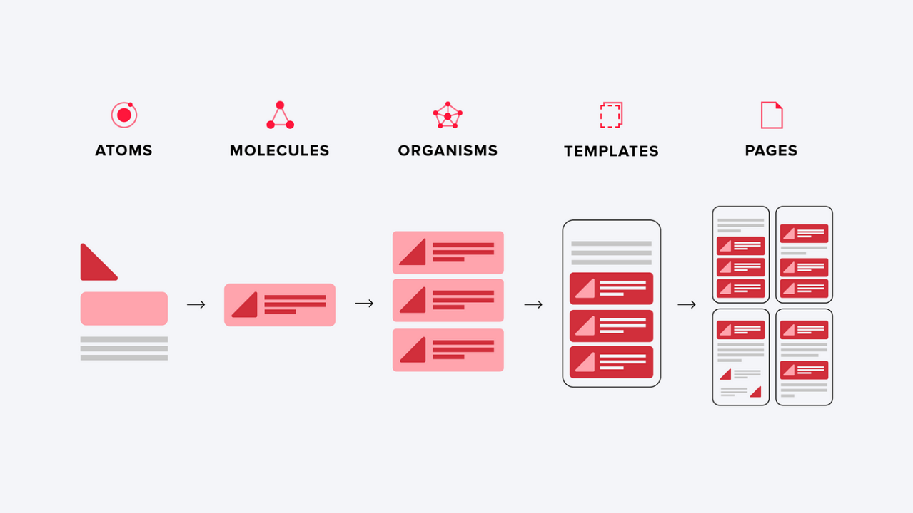

# Important Notes:
1. Java 17 is being used by the project


# Project File Structure

> **Overview**

``` text
.
├── android
├── git
│   └── assets
├── ios
├── node_modules
├── src
│   ├── assets
│   │   ├── icons
│   │   ├── images
│   │   └── fonts
│   ├── components
│   │   ├── atoms
│   │   ├── molecules
│   │   ├── organisms
│   │   ├── pages
│   │   └── templates
│   ├── hooks
│   ├── navigation
│   ├── services
│   ├── store
│   ├── types
│   ├── utils
│   └── App.tsx
├── __tests__
├── app.json
├── babel.config.js
├── Gemfile
├── index.js
├── jest.config.js
├── metro.config.js
├── package.json
├── package-lock.json
├── README.md
└── tsconfig.json
```

> **Breakdown**

- **android**, **ios**: Platform-specific code (native modules or customizable platform-specific settings).

- **git**: GitRepo stuff.
  - **assets**

- **node_modules**: Packages installed for the project (*trough npm/yarn*).

- **src**: Core app code.
  - **assets**: Static assets
    - **icons**
    - **images**
    - **fonts**
  
  - **componets**: Reusable UI components. Refer to [atomic design](#atomic-design) section.
    - **atoms**
    - **molecules**
    - **organisms**
    - **pages**
    - **templates**
  
  - **hooks**: Custom hooks.
  
  - **navigation**: Application navigation logic (navigators, routes, and navigation options).
  
  - **services**
  
  - **store**: Contains the code for managing app state, often using Redux, Zustand, or another state management library. This directory typically includes subfolders for actions, reducers, types, and middleware.
  
  - **types**: A central location for defining global TypeScript types and interfaces that are used throughout the app. This promotes code reusability and type safety.
  
  - **utils**: Stores utility functions, helper methods, and other reusable code that doesn't belong in a specific component or module. This might include date formatting functions, validation logic, or string manipulation utilities.
  
  - **App.tsx**: Main file.

- **app.json**: Contains configuration metadata about React Native app (*name, display name, bundle identifier (iOS), package name (Android), version number, and icon*) that is consumed by React Native's build process.

- **babel.config.js**: Configures Babel, a JavaScript compiler that transforms your modern JavaScript (including JSX, ES6+, and potentially TypeScript) into code that can be understood by older JavaScript environments (like older Android or iOS versions).

- **Gemfile**: Specifies the Ruby gem dependencies for your project. It's primarily used for managing native dependencies in iOS projects (using CocoaPods).

- **index.js**: The entry point of React Native app, first JavaScript file that React Native loads when your app starts. Registers your main app component using AppRegistry.registerComponent. This tells React Native which component to render as the root of your app.

- **jest.config.js**: Configures Jest, a popular JavaScript testing framework. This file tells Jest how to run your tests, where to find them, what reporters to use, and other settings.

- **metro.config.js**: Configures the Metro bundler, which is the JavaScript bundler used by React Native. It takes all of your JavaScript code, dependencies, assets and bundles them into one or more files that can be loaded by your app.

- **package.json**: The heart of your Node.js/npm project (and React Native is built on Node.js). It contains metadata about your project, including its name, version, dependencies, scripts, and more.

- **package-lock.json**: Ensures that everyone working on the project uses the exact same versions of all dependencies.  This prevents unexpected issues caused by different versions of packages. When you install dependencies using **npm install** (*or yarn install*), npm (*or yarn*) creates/updates package-lock.json (*or yarn.lock*). This file records the precise version of every package that was installed, including transitive dependencies (the dependencies of your dependencies). You should always commit this file to your version control system (e.g., Git).

- **README.md**: This file.

- **tsconfig.json**: Configures the TypeScript compiler. If you're using TypeScript in your React Native project, this file tells the TypeScript compiler how to compile your **.ts** and **.tsx** files into JavaScript.


# Atomic Design

<a name="atomic-design"></a>

> **Overview**



- **Atoms**: The fundamental building blocks of your UI. These are the smallest indivisible components like buttons, labels, input fields, icons, and typography styles. They cannot be broken down further without losing their function.

- **Molecules**: Simple groups of UI elements functioning together as a single unit. Examples include a search bar (input + button), a form label with its input, or a navigation item (icon + text).

- **Organisms**: Relatively complex UI sections composed of groups of molecules and/or atoms and even other organisms. They form distinct sections of an interface like a header, a product list, a sidebar, or a comment section.

- **Templates**: Page-level objects that place components in a layout and articulate the design’s underlying structure. Templates define the structure of the page but don't contain actual content. They are wireframes showing where components will be placed.

- **Pages**: Specific instances of templates, populated with real representative content. Pages are what users ultimately see and interact with. They're the fully rendered pages of your app.

# Instructions for cloning from GitHub

I suggest these steps for successful cloning from our remote repository:

1. Firstly, navigate to the folder where you will be cloning the remote repository
2. Open your shell in this directory and run the following:
   ```
   git clone https://github.com/GitQuasar/psu-maps-git
   ```
3. After successful cloning, navigate to the created `psu-maps-git` directory
4. Run the following to install all essential packages with specific versions listed in `package-lock.json`:
   ```
   npm ci
   ```
   after that, make shure that node_modules folder has appeared in the root of the project

# Naming conventions

> Consider sticking to consistent naming conventions.

For this project I suggest:

- **PascalCase** for naming *components* (e.g., MyComponent)

- **camelCase** for naming *variables and functions* (e.g., myVariable, myFunction)

- **kebab-case** for naming *files and directories* (e.g., my-component.tsx)

# Running the app

> Make sure you have completed the [Set Up Your Environment](https://reactnative.dev/docs/set-up-your-environment) guide before proceeding.

## 1. Start Metro (dev server)

Run the following command from the **root** of your React Native project:

```sh
# Using npm
npm start
```

## 2. Run the app

With Metro running, open a new terminal window from the **root** of your React Native project, and use one of the following commands to build and run your Android or iOS app:

### Android

```sh
# Using npm
npm run android
```

### iOS

For iOS, remember to install CocoaPods dependencies (this only needs to be run on first clone or after updating native deps).

The first time you create a new project, run the Ruby bundler to install CocoaPods itself:

```sh
bundle install
```

Then, and every time you update your native dependencies, run:

```sh
bundle exec pod install
```

For more information, please visit [CocoaPods Getting Started guide](https://guides.cocoapods.org/using/getting-started.html).

```sh
# Using npm
npm run ios
```

If everything is set up correctly, you should see your new app running in the Android Emulator, iOS Simulator, or your connected device.

This is one way to run your app — you can also build it directly from Android Studio or Xcode.

## 3. Modify the app

Open `./src/App.tsx` in your text editor of choice and make some changes. When you save, your app will automatically update and reflect these changes — this is powered by [Fast Refresh](https://reactnative.dev/docs/fast-refresh).

When you want to forcefully reload, for example to reset the state of your app, you can perform a full reload:

- **Android**: Press the <kbd>R</kbd> key twice or select **"Reload"** from the **Dev Menu**, accessed via <kbd>Ctrl</kbd> + <kbd>M</kbd> (Windows/Linux) or <kbd>Cmd ⌘</kbd> + <kbd>M</kbd> (macOS).
- **iOS**: Press <kbd>R</kbd> in iOS Simulator.

# Docs

- [React Native: Environment setup](https://reactnative.dev/docs/environment-setup)

- [React Native: Getting started](https://reactnative.dev/docs/getting-started)

- [React Native: Troubleshooting](https://reactnative.dev/docs/troubleshooting)

- [React Native: Website](https://reactnative.dev)

- [React Native: Dev blog](https://reactnative.dev/blog)

- [React Native: GitHub repository](https://github.com/facebook/react-native)
